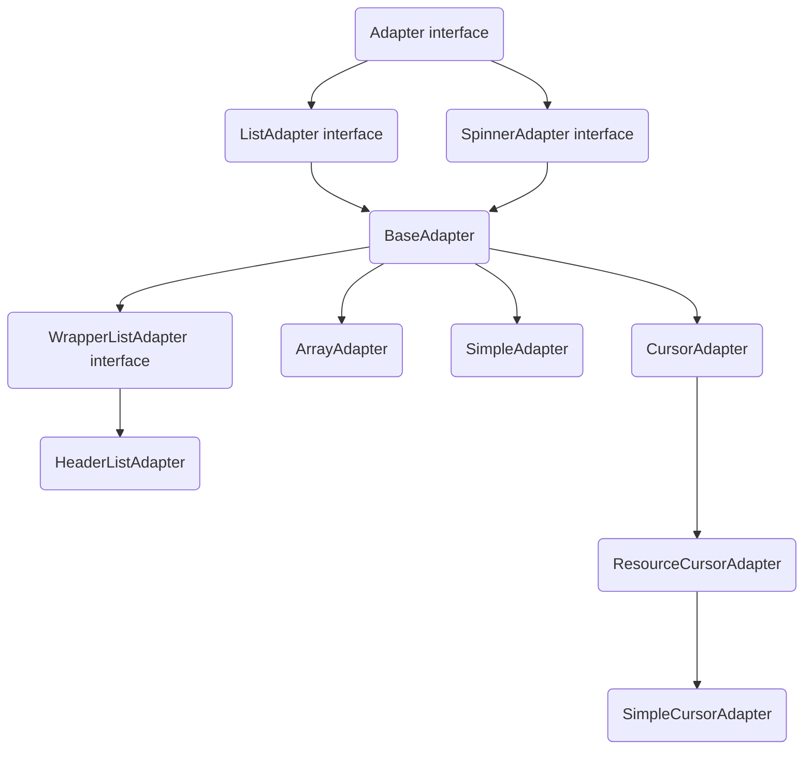

<!-- TOC -->

- [P10\_MainActivity](#p10_mainactivity)
- [P15\_ViewGroupActivity](#p15_viewgroupactivity)
- [P19\_LayoutParamsActivity](#p19_layoutparamsactivity)
- [P20\_PaddingMarginActivity](#p20_paddingmarginactivity)
- [P21\_LinearLayoutActivity](#p21_linearlayoutactivity)
  - [P21-\> LinearLayout 方向](#p21--linearlayout-方向)
  - [P21-\> LinearLayout weigh权重](#p21--linearlayout-weigh权重)
- [P22\_RelativeLayoutActivity](#p22_relativelayoutactivity)
  - [P22-\> RelativeLayout属性说明：](#p22--relativelayout属性说明)
    - [P22-\> 相对于兄弟元素](#p22--相对于兄弟元素)
    - [P22-\> 相对于父元素](#p22--相对于父元素)
    - [P22-\> 对齐方式](#p22--对齐方式)
    - [P22-\> 间隔](#p22--间隔)
- [P23\_FrameLayoutActivity](#p23_framelayoutactivity)
- [P24\_GridLayoutActivity](#p24_gridlayoutactivity)
  - [P24-\> GridLayout问题一](#p24--gridlayout问题一)
  - [P24-\> GridLayout属性](#p24--gridlayout属性)
- [P25\_TextViewActivity](#p25_textviewactivity)
  - [P25-\> TextView (文本框)](#p25--textview-文本框)
  - [P25-\> TextView 属性](#p25--textview-属性)
- [Shape -\> P26\_TextViewShapeActivity](#shape---p26_textviewshapeactivity)
- [P26\_TextViewShapeActivity](#p26_textviewshapeactivity)
  - [P26-\> Shape实现原理：](#p26--shape实现原理)
  - [P26-\> Shape ShapeDrawable的资源文件](#p26--shape-shapedrawable的资源文件)
- [shape的使用](#shape的使用)
  - [1. shape属性](#1-shape属性)
  - [2. shape 基本属性](#2-shape-基本属性)
  - [3. shape 特殊属性](#3-shape-特殊属性)
  - [4. shape 用法](#4-shape-用法)
- [P27\_EditTextActivity](#p27_edittextactivity)
  - [P27-\> EditText 特有属性](#p27--edittext-特有属性)
- [P28\_ButtonActivity](#p28_buttonactivity)
- [selector](#selector)
  - [selector颜色注意事项](#selector颜色注意事项)
- [P29\_ImageViewActivity](#p29_imageviewactivity)
  - [P29-\> ImageView src属性和background属性的区别](#p29--imageview-src属性和background属性的区别)
  - [P29-\> ImageView Java代码中设置blackground和src属性:](#p29--imageview-java代码中设置blackground和src属性)
  - [P29-\> ImageView scaleType 属性 android:scaleType](#p29--imageview-scaletype-属性-androidscaletype)
- [P30\_RadioButtonActivity](#p30_radiobuttonactivity)
  - [P30-\> RadioButton (单选按钮) 基本用法与事件处理：](#p30--radiobutton-单选按钮-基本用法与事件处理)
  - [P30-\> RadioButton 获得选中的值：这里有两种方法](#p30--radiobutton-获得选中的值这里有两种方法)
- [P30\_CheckBoxActivity](#p30_checkboxactivity)
- [P31\_ToggleButtonSwitchActivity](#p31_togglebuttonswitchactivity)
  - [P31-\> ToggleButton](#p31--togglebutton)
  - [P31-\> Switch](#p31--switch)
- [P32\_ProgressBarActivity](#p32_progressbaractivity)
  - [P32-\> ProgressBar 常用属性](#p32--progressbar-常用属性)
  - [P32-\> ProgressBar 对应的再Java中我们可调用下述方法：](#p32--progressbar-对应的再java中我们可调用下述方法)
  - [P32-\> ProgressBar 设置ProgressBar的样式，不同的样式会有不同的形状和模式：](#p32--progressbar-设置progressbar的样式不同的样式会有不同的形状和模式)
- [P33\_SeekBarActivity](#p33_seekbaractivity)
  - [P33-\> SeekBar 常用属性](#p33--seekbar-常用属性)
  - [P33-\> SeekBar 监听事件](#p33--seekbar-监听事件)
  - [P33-\> SeekBar 定制](#p33--seekbar-定制)
- [P34\_ScrollViewActivity](#p34_scrollviewactivity)
- [P34\_ScrollViewFrameLayoutActivity](#p34_scrollviewframelayoutactivity)
  - [问题一：新增加按钮点击没有反应](#问题一新增加按钮点击没有反应)
- [P35\_TextClockActivity](#p35_textclockactivity)
  - [TextClock(文本时钟)](#textclock文本时钟)
  - [TextClock(文本时钟)遇到问题一：](#textclock文本时钟遇到问题一)
  - [AnalogClock(模拟时钟)](#analogclock模拟时钟)
- [P35\_ChronometerActivity](#p35_chronometeractivity)
- [P36\_DateTimeActivity](#p36_datetimeactivity)
  - [DatePicker(日期选择器)](#datepicker日期选择器)
  - [TimePicker(时间选择器)](#timepicker时间选择器)
  - [CalendarView(日历视图)](#calendarview日历视图)
- [P37\_AdapterActivity](#p37_adapteractivity)
  - [AdapterView即Adapter（适配器）控件](#adapterview即adapter适配器控件)
- [P38\_ListViewActivity](#p38_listviewactivity)
  - [P38-\> 自定义adapter步骤](#p38--自定义adapter步骤)
  - [P38-\> BaseAdapter 优化](#p38--baseadapter-优化)
  - [P38-\> ListView item多布局实现](#p38--listview-item多布局实现)
  - [P38-\> ListView 表头表尾分割线的设置](#p38--listview-表头表尾分割线的设置)
  - [P38-\> ListView 点击事件和长按事件](#p38--listview-点击事件和长按事件)
  - [P38-\> ListView selector](#p38--listview-selector)
  - [P38-\> ListView item中有button会被抢占焦点](#p38--listview-item中有button会被抢占焦点)
- [value](#value)
  - [color](#color)
- [](#)

<!-- /TOC -->

# P10_MainActivity
新建工程  

# P15_ViewGroupActivity
通过java代码实例化布局参数，并加载  

# P19_LayoutParamsActivity
获取布局参数，并在log中显示出来  

# P20_PaddingMarginActivity
内外边距
   margin外边距  
   padding内边距  

# P21_LinearLayoutActivity
线性布局  
## P21-> LinearLayout 方向
竖直  
```xml {.line-numbers}
android:orientation="vertical" //水平
``` 
水平
```  
android:orientation="horizontal"  
``` 
## P21-> LinearLayout weigh权重
```  
android:layout_weight="2"
```  
设置权重则对应方向尺寸失效，所以最好设置为0。
如
```
android:layout_width="0dp"
android:layout_height="0dp"
```

# P22_RelativeLayoutActivity
相对布局  
## P22-> RelativeLayout属性说明：
### P22-> 相对于兄弟元素  
|属性名称|属性含义|
|---|----|
|android:layout_below="@id/aaa" |在指定View的下方|
|android:layout_above="@id/aaa" |在指定View的上方|
|android:layout_toLeftOf="@id/aaa" |在指定View的左边|
|android:layout_toRightOf="@id/aaa" |在指定View的右边|
|android:layout_alignTop="@id/aaa" |与指定View的上边界一致|
|android:layout_alignBottom="@id/aaa" |与指定View下边界一致|
|android:layout_alignLeft="@id/aaa" |与指定View的左边界一致|
|android:layout_alignRight="@id/aaa" |与指定View的右边界一致|
### P22-> 相对于父元素
|属性名称 |属性含义|
|---|----|
|android:layout_alignParentLeft="true" |在父元素内左边|
|android:layout_alignParentRight="true" |在父元素内右边|
|android:layout_alignParentTop="true" |在父元素内顶部|
|android:layout_alignParentBottom="true" |在父元素内底部|
###  P22-> 对齐方式
|属性名称| 属性含义|
|---|----|
|android:layout_centerInParent="true" |居中布局|
|android:layout_centerVertical="true" |垂直居中布局|
|android:layout_centerHorizontal="true" |水平居中布局|
###  P22-> 间隔
|属性名称 |属性含义|
|---|----|
|android:layout_marginBottom="" |离某元素底边缘的距离|
|android:layout_marginLeft="" |离某元素左边缘的距离|
|android:layout_marginRight ="" |离某元素右边缘的距离|
|android:layout_marginTop="" |离某元素上边缘的距离|
|android:layout_paddingBottom="" |往内部元素底边缘填充距离|
|android:layout_paddingLeft="" |往内部元素左边缘填充距离|
|android:layout_paddingRight ="" |往内部元素右边缘填充距离|
|android:layout_paddingTop="" |往内部元素右边缘填充距离|

# P23_FrameLayoutActivity
帧布局  
帧布局的特点，会按照排列顺序依次覆盖  

# P24_GridLayoutActivity
网格布局  
## P24-> GridLayout问题一
[按钮颜色始终是蓝紫色解决办法](https://www.cnblogs.com/szyx/p/16376851.html)  
我的解决方法：  
默认的颜色设置来自于res/values/themes.xml与夜间模式下的res/values-night/themes.xml  
修改themes.xml下的  
```html
<style name="Theme.HelloWorld" parent="Theme.MaterialComponents.DayNight.DarkActionBar">
```
修改为
```html
<style name="Theme.HelloWorld" parent="Theme.MaterialComponents.DayNight.DarkActionBar.Bridge">
```
## P24-> GridLayout属性
|名称 |含义|
|---|----|
|android:columnCount |列数|
|android:rowCount |行数|
|android:layout_columnSpan |横跨的列数|
|android:layout_rowSpan |横跨的行数|
```xml {.line-numbers}
<!--    android:layout_gravity="fill"-->
<!--    设置这个属性才会填充满两列-->
```

# P25_TextViewActivity
## P25-> TextView (文本框)
用于显示文本的一个控件。  
**文本的字体尺寸单位为 sp :**  
   sp: scaled pixels(放大像素). 主要用于字体显示。  
## P25-> TextView 属性   
|属性名 |作用|
|---|----|
|id |为TextView设置一个组件id，根据id，我们可以在Java代码中通过findViewById()的方法获取到该对象，然后进行相关属性的设置|
|layout_width |组件的宽度|
|layout_height |组件的高度|
|gravity |设置控件中内容的对齐方向，TextView中是文字，ImageView中是图片等等|
|text|设置显示的文本内容，一般我们是把字符串写到string.xml文件中，然后通过@String/xxx取得对应的字符串内容的|
|textColor |设置字体颜色，同上，通过colors.xml资源来引用|
|textStyle |设置字体风格，三个可选值：normal(无效果)，bold(加粗)，italic(斜体)|
|textSize |字体大小，单位一般是用sp|
|background |控件的背景颜色，可以理解为填充整个控件的颜色，可以是图片|
|autoLink |识别链接类型 （web, email, phone ,map ,none, all）|

# Shape -> P26_TextViewShapeActivity
# P26_TextViewShapeActivity
文本设置边框

## P26-> Shape实现原理：
编写一个ShapeDrawable的资源文件！然后TextView将 background 设置为这个drawable资源即可
## P26-> Shape ShapeDrawable的资源文件
* <solid android:color = "xxx"> 这个是设置背景颜色的
* <stroke android:width = "xdp" android:color="xxx"> 这个是设置边框的粗细,以及边框颜色的
* <padding androidLbottom = "xdp"...> 这个是设置边距的
* <corners android:topLeftRadius="10px"...> 这个是设置圆角的
* <gradient> 这个是设置渐变色的,可选属性有: startColor:起始颜色 endColor:结束颜色 centerColor:中间颜色 angle:方向角度,等于0时,从左到右,然后逆时针方向转,当angle = 90度时从下往上 type:设置渐变的类型编写矩形边框的Drawable：
* 编写矩形边框的Drawable：
```xml {.line-numbers}
<?xml version="1.0" encoding="utf-8"?>
<shape
   xmlns:android="http://schemas.android.com/apk/res/android"
   >
<!-- 设置一个黑色边框 -->
   <stroke android:width="2px" android:color="#000000"/>
<!-- 渐变 -->
   <gradient
      android:angle="270"
      android:endColor="#C0C0C0"
      android:startColor="#FCD209" />
<!-- 设置一下边距,让空间大一点 -->
   <padding
      android:left="5dp"
      android:top="5dp"
      android:right="5dp"
      android:bottom="5dp"/>
</shape>
```
* 编写圆角矩形边框的Drawable
```xml {.line-numbers}
<?xml version="1.0" encoding="utf-8"?>
<shape
  xmlns:android="http://schemas.android.com/apk/res/android"
  >
  <!-- 设置透明背景色 -->
  <solid android:color="#87CEEB" />
  <!-- 设置一个黑色边框 -->
  <stroke
    android:width="2px"
    android:color="#000000" />
  <!-- 设置四个圆角的半径 -->
  <corners
    android:bottomLeftRadius="10px"
    android:bottomRightRadius="10px"
    android:topLeftRadius="10px"
    android:topRightRadius="10px" />
  <!-- 设置一下边距,让空间大一点 -->
  <padding
    android:bottom="5dp"
    android:left="5dp"
    android:right="5dp"
    android:top="5dp" />
</shape>
```
* 带图片(drawableXxx)的TextView   

|属性名 |作用|
|---|---|
|android:drawableLeft |文本左边设置图片|
|android:drawableRight |文本右边设置图片|
|android:drawableBottom |文本下边设置图片|
|android:drawableTop |文本上边设置图片|

# shape的使用
在Android开发中，我们可以使用shape定义各种各样的形状，也可以定义一些图片资源。相对于传统图片来说，使用shape可以减少资源占用，减少安装包大小，还能够很好地适配不同尺寸的手机。  
## 1. shape属性
shape 属性基本语法示例：  
```xml {.line-numbers}
<?xml version="1.0" encoding="utf-8"?>
<shape
  xmlns:android="http://schemas.android.com/apk/res/android"
  android:shape=["rectangle" | "oval" | "line" | "ring"] > // 定义形状
  <corners //圆角属性
    android:radius="integer"
    android:topLeftRadius="integer"
    android:topRightRadius="integer"
    android:bottomLeftRadius="integer"
    android:bottomRightRadius="integer" />
  <gradient //渐变属性
    android:angle="integer"
    android:centerX="integer"
    android:centerY="integer"
    android:centerColor="integer"
    android:endColor="color"
    android:gradientRadius="integer"
    android:startColor="color"
    android:type=["linear" | "radial" | "sweep"]
    android:useLevel=["true" | "false"] />
  <padding //边距属性
    android:left="integer"
    android:top="integer"
    android:right="integer"
    android:bottom="integer" />
  <size //大小属性
    android:width="integer"
    android:height="integer" />
  <solid //填充属性
    android:color="color" />
  <stroke //描边属性
    android:width="integer"
    android:color="color"
    android:dashWidth="integer"
    android:dashGap="integer" />
</shape>
```
## 2. shape 基本属性
Shape可以定义控件的一些展示效果，例如圆角，渐变，填充，描边，大小，边距； shape 子标签就可以实现这些效果， shape 子标签有下面几个属性：corners，gradient，padding，size，solid，stroke：  

* **corners（圆角）**是用来字义圆角
```xml {.line-numbers}
<?xml version="1.0" encoding="utf-8"?>
<shape xmlns:android="http://schemas.android.com/apk/res/android" >
  <corners //定义圆角
    android:radius="10dp" //全部的圆角半径；
    android:topLeftRadius="5dp" //左上角的圆角半径；
    android:topRightRadius="5dp" //右上角的圆角半径；
    android:bottomLeftRadius="5dp" //左下角的圆角半径；
    android:bottomRightRadius="5dp" /> //右下角的圆角半径。
</shape>
```
* **solid（填充色）**是用以指定内部填充色；
```xml {.line-numbers}
<?xml version="1.0" encoding="utf-8"?>
<shape xmlns:android="http://schemas.android.com/apk/res/android" >
  <solid android:color="#ffff00"/> //内部填充色
</shape>
```
* **gradient（渐变）**用以定义渐变色，可以定义两色渐变和三色渐变，及渐变样式；
```xml {.line-numbers}
<?xml version="1.0" encoding="utf-8"?>
<shape xmlns:android="http://schemas.android.com/apk/res/android" >
  <gradient
    android:type=["linear" | "radial" | "sweep"] //共有3中渐变类型，线性渐变（默认）/放射渐变/扫描式渐变；
    android:angle="90" //渐变角度，必须为45的倍数，0为从左到右，90为从上到下；
    android:centerX="0.5" //渐变中心X的相当位置，范围为0～1；
    android:centerY="0.5" //渐变中心Y的相当位置，范围为0～1；
    android:startColor="#24e9f2" //渐变开始点的颜色；
    android:centerColor="#2564ef" //渐变中间点的颜色，在开始与结束点之间；
    android:endColor="#25f1ef" //渐变结束点的颜色；
    android:gradientRadius="5dp" //渐变的半径，只有当渐变类型为radial时才能使用；
    android:useLevel="false" /> //使用LevelListDrawable时就要设置为true。设为false时才有渐变效果。
</shape>
```
* **stroke（描边）**是描边属性，可以定义描边的宽度，颜色，虚实线等；
```xml {.line-numbers}
<?xml version="1.0" encoding="utf-8"?>
<shape xmlns:android="http://schemas.android.com/apk/res/android" >
  <stroke
    android:width="1dp" //描边的宽度
    android:color="#ff0000" //描边的颜色
    // 以下两个属性设置虚线
    android:dashWidth="1dp" //虚线的宽度，值为0时是实线
    android:dashGap="1dp" /> //虚线的间隔
</shape>
```
* **padding（内边距）**是用来定义内部边距
```xml {.line-numbers}
<?xml version="1.0" encoding="utf-8"?>
<shape xmlns:android="http://schemas.android.com/apk/res/android" >
  <padding
    android:left="10dp" //左内边距；
    android:top="10dp" //上内边距；
    android:right="10dp" //右内边距；
    android:bottom="10dp" /> //下内边距。
</shape>
```
* **size（大小）**标签是用来定义图形的大小的
```xml {.line-numbers}
<?xml version="1.0" encoding="utf-8"?>
<shape xmlns:android="http://schemas.android.com/apk/res/android" >
  <size
    android:width="50dp" //宽度
    android:height="50dp" />// 高度
</shape>
```
## 3. shape 特殊属性
Shape可以定义当前Shape的形状的，比如矩形，椭圆形，线形和环形；这些都是通过 shape 标签属性来定义的， shape 标签有下面几个属性：rectangle，oval，line，ring：  
```xml {.line-numbers}
<?xml version="1.0" encoding="utf-8"?>
<shape xmlns:android="http://schemas.android.com/apk/res/android"
  android:shape=["rectangle" | "oval" | "line" | "ring"] //shape的形状，默认为矩形，可以设置为矩形(rectangle)、椭圆形(oval)、线性形状(line)、环形(ring)
  //下面的属性只有在android:shape="ring"时可用：
  android:innerRadius="10dp" // 内环的半径；
  android:innerRadiusRatio="2" // 浮点型，以环的宽度比率来表示内环的半径；
  android:thickness="3dp" // 环的厚度；
  android:thicknessRatio="2" // 浮点型，以环的宽度比率来表示环的厚度；
  android:useLevel="false"> // boolean值，如果当做是LevelListDrawable使用时值为true，否则为false。
</shape>
```
* rectangle（矩形）
```xml {.line-numbers}
<?xml version="1.0" encoding="utf-8"?>
<shape xmlns:android="http://schemas.android.com/apk/res/android"
  android:shape="rectangle">
  <solid android:color="@color/colorPrimary"/>
</shape>
```
* oval（椭圆）
```xml {.line-numbers}
<?xml version="1.0" encoding="utf-8"?>
<shape xmlns:android="http://schemas.android.com/apk/res/android"
  android:shape="oval">
  <solid android:color="@color/colorPrimary"/>
  <size android:height="100dp"
    android:width="100dp"/>
</shape>
```
* line（线）
```xml {.line-numbers}
<?xml version="1.0" encoding="utf-8"?>
<shape xmlns:android="http://schemas.android.com/apk/res/android"
  android:shape="line">
  <stroke
    android:width="1dp"
    android:color="@color/colorAccent"
    android:dashGap="3dp"//虚线间距
    android:dashWidth="4dp"/>//虚线宽度
  <size android:height="3dp"/>
</shape>
```
* ring（圆环）
```xml {.line-numbers}
<?xml version="1.0" encoding="utf-8"?>
<shape xmlns:android="http://schemas.android.com/apk/res/android"
  android:shape="ring"
  android:useLevel="false"
  android:innerRadius="20dp" // 内环的半径
  android:thickness="10dp"> // 圆环宽度
  <!--useLevel需要设置为false-->
  <solid android:color="@color/colorAccent"/>
</shape>
```
## 4. shape 用法
1. 在res/drawable下新建 shape_text.xml 文件；
2. 在布局中引用 shape_text.xml 文件；

# P27_EditTextActivity
1. EditText 输入框，集成与TextView, 也继承其属性
## P27-> EditText 特有属性

|属姓名 |说明|
|---|---|
|android:hint |默认提示文本|
|android:textColorHint |默认提示文本的颜色|
|android:selectAllOnFocus |布尔值。点击输入框获得焦点后，获取到输入框中所有的文本内容|
|android:inputType |对输入的数据进行限制|
|android:minLines |设置最小行数|
|android:maxLines |设置最大行数 PS:当输入内容超过maxline,文字会自动向上滚动！！|
|android:singleLine |只允许单行输入，而且不会滚动|
|android:textScaleX |设置字与字的水平间隔|
|android:textScaleY |设置字与字的垂直间隔|
|android:capitalizesentences：|仅第一个字母大写 ；words：每一个单词首字母大小，用空格区分单词；characters:每一个英文字母都大写|

# P28_ButtonActivity
Button(按钮)
Button 控件继承 TextView ，拥有 TextView 的属性
StateListDrawable 简介
StateListDrawable 是Drawable资源的一种，可以根据不同的状态，设置不同的图片效果，关键节点 < selector > ，我们只需要将Button的 background 属性设置为该drawable资源即可轻松实现，按下 按钮时不同的按钮颜色或背景！  
|属性名 |说明|
|---|--|
drawable |引用的Drawable位图,我们可以把他放到最前面,就表示组件的正常状态~|
|state_focused |是否获得焦点|
|state_window_focused |是否获得窗口焦点|
|state_enabled |控件是否可用|
|state_checkable |控件可否被勾选|
|state_checked |控件是否被勾选|
|state_selected |控件是否被选择,针对有滚轮的情况|
|state_pressed |控件是否被按下|
|state_active |控件是否处于活动状态|
|state_single |控件包含多个子控件时,确定是否只显示一个子控件|
|state_first |控件包含多个子控件时,确定第一个子控件是否处于显示状态|
|state_middle |控件包含多个子控件时,确定中间一个子控件是否处于显示状态|
|state_last |控件包含多个子控件时,确定最后一个子控件是否处于显示状态|

# selector
* btn_bg1.xml
```xml {.line-numbers}
<?xml version="1.0" encoding="utf-8"?>
<selector xmlns:android="http://schemas.android.com/apk/res/android">
  <item android:drawable="@color/color1" android:state_pressed="true"/>
  <item android:drawable="@color/color4" android:state_enabled="false"/>
  <item android:drawable="@color/color3" />
</selector>
```
## selector颜色注意事项
selector颜色不能直接用#f00
必须用字符串引用

# P29_ImageViewActivity
ImageView 见名知意，就是用来显示图像的一个View或者说控件
需掌握的知识点：
1. ImageView的src属性和blackground的区别；
2. adjustViewBounds设置图像缩放时是否按长宽比
3. scaleType设置缩放类型
4. 最简单的绘制圆形的ImageView
## P29-> ImageView src属性和background属性的区别
在API文档中我们发现ImageView有两个可以设置图片的属性，分别是：src和background
常识：  
1. background通常指的都是背景,而src指的是内容!!  
2. 当使用src填入图片时,是按照图片大小直接填充,并不会进行拉伸,而使用background填入图片,则是会根据ImageView给定的宽度来进行拉伸  
## P29-> ImageView Java代码中设置blackground和src属性:
```java {.line-numbers}
setImageDrawable();//前景(对应src属性):
setBackgroundDrawable();//背景(对应background属性):
```
## P29-> ImageView scaleType 属性 android:scaleType
android:scaleType用于设置显示的图片如何缩放或者移动以适应ImageView的大小 
Java代码中可以通过
```java {.line-numbers}
imageView.setScaleType(ImageView.ScaleType.CENTER);
```
来设置~ 可选值如下：
1. fitXY:对图像的横向与纵向进行独立缩放,使得该图片完全适应ImageView,但是图片的横纵比可能会发生改变
2. fitStart:保持纵横比缩放图片,知道较长的边与Image的编程相等,缩放完成后将图片放在ImageView的左上角
3. fitCenter:同上,缩放后放于中间;
4. fitEnd:同上,缩放后放于右下角;
5. center:保持原图的大小，显示在ImageView的中心。当原图的size大于ImageView的size，超过部分裁剪处理。
6. centerCrop:保持横纵比缩放图片,知道完全覆盖ImageView,可能会出现图片的显示不完全
7. centerInside:保持横纵比缩放图片,直到ImageView能够完全地显示图片
8. matrix:默认值，不改变原图的大小，从ImageView的左上角开始绘制原图， 原图超过ImageView的部分作裁剪处理

# P30_RadioButtonActivity
## P30-> RadioButton (单选按钮) 基本用法与事件处理：
单选按钮，就是只能够选中一个，所以我们需要把RadioButton放到RadioGroup按钮组中，从而实现 单选功能！
先熟悉下如何使用RadioButton，一个简单的性别选择的例子： 
另外我们可以为外层RadioGroup设置orientation属性然后设置RadioButton的排列方式，是竖直还是水平
## P30-> RadioButton 获得选中的值：这里有两种方法
1. 第一种是为 RadioButton 设置一个事件监听器 setOnCheckChangeListener
```java {.line-numbers}
RadioGroup radgroup = (RadioGroup) findViewById(R.id.radioGroup);
//第一种获得单选按钮值的方法
//为radioGroup设置一个监听器:setOnCheckedChanged()
radgroup.setOnCheckedChangeListener(new OnCheckedChangeListener() {
   @Override
   public void onCheckedChanged(RadioGroup group, int checkedId) {
      RadioButton radbtn = (RadioButton) findViewById(checkedId);
      Toast.makeText(getApplicationContext(), "按钮组值发生改变,你选了" + radbtn.getText(), Toast.LENGTH_LONG).show();
   }
});
```
PS：另外有一点要切记，要为每个 RadioButton 添加一个id，不然单选功能不会生效！！！
2. 第二种方法是通过单击其他按钮获取选中单选按钮的值，当然我们也可以直接获取，这个看需求~
```java {.line-numbers}
Button btnchange = (Button) findViewById(R.id.btnpost);
RadioGroup radgroup = (RadioGroup) findViewById(R.id.radioGroup);
//为radioGroup设置一个监听器:setOnCheckedChanged()
btnchange.setOnClickListener(new OnClickListener() {
   @Override
   public void onClick(View v) {
      for (int i = 0; i < radgroup.getChildCount(); i++) {
         RadioButton rd = (RadioButton) radgroup.getChildAt(i);
         if (rd.isChecked()) {
            Toast.makeText(getApplicationContext(), "点击提交按钮,获取你选择的是:" + rd.getText(), Toast.LENGTH_LONG).show();
            break;
         }
      }
   }
});
```
代码解析： 
这里我们为提交按钮设置了一个 setOnClickListener 事件监听器,每次点击的话遍历一次RadioGroup判断哪个按钮被选中。
我们可以通过下述方法获得RadioButton的相关信息！
```java {.line-numbers}
getChildCount( )//获得按钮组中的单选按钮的数目；
getChinldAt(i)//根据索引值获取我们的单选按钮
isChecked( )//判断按钮是否选中
```

# P30_CheckBoxActivity
CheckBox (复选框)  
如题复选框，即可以同时选中多个选项，至于获得选中的值，同样有两种方式： 
1. 为每个CheckBox添加事件：  setOnCheckedChangeListener   
2. 弄一个按钮，在点击后，对每个checkbox进行判断:isChecked()

# P31_ToggleButtonSwitchActivity
## P31-> ToggleButton
|属性名 |说明|
---|---
|android:disabledAlpha |设置按钮在禁用时的透明度|
|android:textOff |按钮没有被选中时显示的文字|
|android:textOn |按钮被选中时显示的文字 另外，除了这个我们还可以自己写个selector，然后设置下Background属性即可|
## P31-> Switch
|属性名 |说明|
---|---
|android:showText |设置on/off的时候是否显示文字,boolean|
|android:splitTrack |是否设置一个间隙，让滑块与底部图片分隔,boolean|
|android:switchMinWidth |设置开关的最小宽度|
|android:switchPadding |设置滑块内文字的间隔|
|android:switchTextAppearance |设置开关的文字外观|
|android:textOff |按钮没有被选中时显示的文字|
|android:textOn |按钮被选中时显示的文字|
|android:textStyle |文字风格，粗体，斜体写划线那些|
|android:track |底部的图片|
|android:thumb |滑块的图片|
|android:typeface |设置字体，默认支持这三种:sans, serif, monospace;除此以外还可以使用 其他字体文件(*.ttf)|

# P32_ProgressBarActivity
## P32-> ProgressBar 常用属性
|属性名 |说明|
---|---
|android:max：|进度条的最大值|
|android:progress：|进度条已完成进度值|
|android:progressDrawable：|设置轨道对应的Drawable对象|
|android:indeterminate：|如果设置成true，则进度条不精确显示进度|
|android:indeterminateDrawable：|设置不显示进度的进度条的Drawable对象|
|android:indeterminateDuration：|设置不精确显示进度的持续时间|
|android:secondaryProgress：|二级进度条，类似于视频播放的一条是当前播放进度，一条是缓冲进度，前者通过progress属性进行设置！|

## P32-> ProgressBar 对应的再Java中我们可调用下述方法：
|方法 |说明|
---|---
|getMax()：|返回这个进度条的范围的上限|
|getProgress()：|返回进度|
|getSecondaryProgress()：|返回次要进度|
|incrementProgressBy(int diff)：|指定增加的进度|
|isIndeterminate()：|指示进度条是否在不确定模式下|
|setIndeterminate(boolean indeterminate)：|设置不确定模式下|

## P32-> ProgressBar 设置ProgressBar的样式，不同的样式会有不同的形状和模式：

Widget.ProgressBar.Horizontal
横向进度条（精确模式或模糊模式，这取决于Android:indeterminate）。
Widget.ProgressBar
中号的圆形进度条（模糊模式）。
Widget.ProgressBar.Small
小号的圆形进度条（模糊模式）。
Widget.ProgressBar.Large
大号的圆形进度条（模糊模式）。
Widget.ProgressBar.Inverse
中号的圆形进度条（模糊模式），该样式适用于亮色背景（例如白色）。
Widget.ProgressBar.Small.Inverse
小号的圆形进度条（模糊模式），该样式适用于亮色背景（例如白色）。
Widget.ProgressBar.Large.Inverse
大号的圆形进度条（模糊模式）。

# P33_SeekBarActivity
## P33-> SeekBar 常用属性
android:max="100" //滑动条的最大值  
android:progress="60" //滑动条的当前值  
android:secondaryProgress="70" //二级滑动条的进度  
android:thumb = "@mipmap/sb_icon" //滑块的drawable  
## P33-> SeekBar 监听事件
SeekBar.OnSeekBarChangeListener 我们只需重写三个对应的方
法  
onProgressChanged：进度发生改变时会触发
onStartTrackingTouch：按住SeekBar时会触发
onStopTrackingTouch：放开SeekBar时触发
## P33-> SeekBar 定制
1. 滑块状态Drawable：sb_thumb.xml
```xml {.line-numbers}
<?xml version="1.0" encoding="utf-8"?>
<selector xmlns:android="http://schemas.android.com/apk/res/android">
   <item android:state_pressed="true"
      android:drawable="@mipmap/seekbar_thumb_pressed"/>
   <item android:state_pressed="false"
      android:drawable="@mipmap/seekbar_thumb_normal"/>
</selector>
```
2. 条形栏Bar的Drawable：sb_bar.xml
  这里用到一个layer-list的drawable资源！其实就是层叠图片，依次是:背景，二级进度条，当前进度：
```xml {.line-numbers}
<?xml version="1.0" encoding="utf-8"?>
<layer-list
xmlns:android="http://schemas.android.com/apk/res/android">
   <item android:id="@android:id/background">
      <shape>
         <solid android:color="#FFFFD042" />
      </shape>
   </item>
   <item android:id="@android:id/secondaryProgress">
      <clip>
         <shape>
            <solid android:color="#FFFFFFFF" />
         </shape>
      </clip>
   </item>
   <item android:id="@android:id/progress">
      <clip>
         <shape>
            <solid android:color="#FF96E85D" />
         </shape>
      </clip>
   </item>
</layer-list>
```
3. 然后布局引入SeekBar后，设置下progressDrawable与thumb即可
```xml {.line-numbers}
<SeekBar
   android:id="@+id/sb_normal"
   android:layout_width="match_parent"
   android:layout_height="wrap_content"
   android:maxHeight="5.0dp"
   android:minHeight="5.0dp"
   android:progressDrawable="@drawable/sb_bar"
   android:thumb="@drawable/sb_thumb"/>
```

# P34_ScrollViewActivity
我们可以直接利用ScrollView给我们提供的:fullScroll()方法：
```java {.line-numbers}
scrollView.fullScroll(ScrollView.FOCUS_DOWN);//滚动到底部
scrollView.fullScroll(ScrollView.FOCUS_UP);//滚动到顶部

//设置滚动速度:
//继承ScrollView，然后重写一个 public void fling (int velocityY)的方法：
@Override
public void fling(int velocityY) {
super.fling(velocityY / 2); //速度变为原来的一半
} 
//tips: ScrollView控件中只能包含一个View或一个ViewGroup
```
```xml {.line-numbers}
<!-- 隐藏滑块: -->
android:scrollbars="none"
```

# P34_ScrollViewFrameLayoutActivity
根据教程更改
   1.将scrollView填充和清除独立成函数
   2.修改布局，增加一个清除填充按键，实现三个按键浮于滚动条上方
## P34-> ScrollView FrameLayout 问题一：新增加按钮点击没有反应
按钮新增步骤
//1. 声明按钮控件
//2. 绑定按钮控件
//3. 实现监听按钮事件
//4. 注册监听事件
如果没有第四步，在模拟器中按钮点击是没有声音的

# P35_TextClockActivity
## P35-> TextClock(文本时钟)
TextClock是在Android 4.2(API 17)后推出的用来替代DigitalClock的一个控件！
TextClock可以以字符串格式显示当前的日期和时间，因此推荐在Android 4.2以后使用TextClock。  
这个控件推荐在24进制的android系统中使用，TextClock提供了两种不同的格式：  
一种是在24进制中显示时间和日期，  
另一种是在12进制中显示时间和日期。大部分人喜欢默认的设置。  

另外他给我们提供了下面这些方法，对应的还有get方法：
|Attribute Name |Related Method |Description|
|:--- | :--- | :--- |
|属性名字 |提供方法 |描述|
|android:format12Hour |setFormat12Hour(CharSequence) |设置12时制的格式|
|android:format24Hour |setFormat24Hour(CharSequence) |设置24时制的格式|
|android:timeZone |setTimeZone(String) |设置时区|
## P35-> TextClock(文本时钟)遇到问题一：
1. 问题：  
   完全参考例程，在虚拟机运行正常，但是在真机运行不正常。  
2. 原因：  
   实测为，虚拟机应该是默认12h制，而提供的例程只写了12h的格式，所以在虚拟机上运行正常。但是真机系统设置的是24h制，所以无法正常显示，但是把真机系统调成12h制可以正常显示。也就是TextClock控件是按照12h小时还是24h显示，取决于系统设置。  
3. 解决办法： 
   所以需要在例程的基础上加上24h显示格式  

## P35-> AnalogClock(模拟时钟)
```xml {.line-numbers}
android:dial //表背景图片
android:hand_hour //表时针图片
android:hand_minute //分时针图片
```

# P35_ChronometerActivity
```Java {.line-numbers}
chronometer.start();// 开始计时
chronometer.stop();// 停止计时
chronometer.setBase(SystemClock.elapsedRealtime());// 复位
chronometer.setFormat("Time：%s");// 更改时间显示格式
///计时器时间到了事件方法
@Override
public void onChronometerTick(Chronometer chronometer) {
  String time = chronometer.getText().toString();
  if (time.equals("00:00")) {
      Toast.makeText(this, "时间到了~", Toast.LENGTH_SHORT).show();
  }
}
```

# P36_DateTimeActivity
## P36-> DatePicker(日期选择器)
```xml {.line-numbers}
android:calendarTextColor ： 日历列表的文本的颜色
android:calendarViewShown：是否显示日历视图
android:datePickerMode：组件外观，可选值:spinner（下拉），calendar 默认效果是后者
android:dayOfWeekBackground：顶部星期几的背景颜色
android:dayOfWeekTextAppearance：顶部星期几的文字颜色
android:endYear：去年(内容)比如2010
android:firstDayOfWeek：设置日历列表以星期几开头
android:headerBackground：整个头部的背景颜色
android:headerDayOfMonthTextAppearance：头部日期字体的颜色
android:headerMonthTextAppearance：头部月份的字体颜色
android:headerYearTextAppearance：头部年的字体颜色
android:maxDate：最大日期显示在这个日历视图mm / dd / yyyy格式
android:minDate：最小日期显示在这个日历视图mm / dd / yyyy格式
android:spinnersShown：是否显示spinner
android:startYear：设置第一年(内容)，比如19940年
android:yearListItemTextAppearance：列表的文本出现在列表中。
android:yearListSelectorColor：年列表选择的颜色

```
## P36-> TimePicker(时间选择器)

## P36-> CalendarView(日历视图)
```xml {.line-numbers}
android:firstDayOfWeek：设置一个星期的第一天
android:maxDate ：最大的日期显示在这个日历视图mm / dd / yyyy格式
android:minDate：最小的日期显示在这个日历视图mm / dd / yyyy格式
android:weekDayTextAppearance：工作日的文本出现在日历标题缩写
```

# P37_AdapterActivity
## P37-> AdapterView即Adapter（适配器）控件
AdapterView适配器View常用的有：
ListView、GridView、Spinner、RecycleView  
其内容通常是一个包含多项相同格式资源的列表，每次只显示其中一项。这个存放Adapter控件内容的列表，  
在android被称为AdapterView（适配器View）使用的时候一般都会先给适配器填充内容。然后将已经设定好内容的适配器（Adapter）设置到AdapterView上  



* BaseAdapter：抽象类，实际开发中我们会继承这个类并且重写相关方法，用得最多的一个Adapter！  
* ArrayAdapter ：支持泛型操作，最简单的一个Adapter，只能展现一行文字~  
* SimpleAdapter ：同样具有良好扩展性的一个Adapter，可以自定义多种效果！  
* SimpleCursorAdapter：用于显示简单文本类型的listView，一般在数据库那里会用到，不过有点过时， 不推荐使用！  

# P38_ListViewActivity
## P38-> 自定义adapter步骤
1. 新建activity layout。Activity布局文件。  
2. 新建item layout。用于填充。  
3. 新建item layout的实体类。用于处理item数据。  
4. 新建继承自BaseAdapter的ItemAdapter类，并重写一下方法：  
   BaseAdapter最基本的几个方法：  
   1. getCount 填充的数据集数  
   2. getItem 数据集中指定索引对应的数据项  
   3. getItemId 指定行所对应的ID  
   4. getView 每个Item所显示的类容  
5. 新建Activity。
   1. 绑定activity layout控件。
   2. 新建item layout的实体类数组。用以填充Adapter数据。
   3. 新建ItemAdapter对象。数据填充为item layout的实体类数组。
   4. 控件设置Adapter为ItemAdapter对象。
   5. 控件设置Item点击事件。
## P38-> BaseAdapter 优化
1. 复用ConvertView
inflate()每次都要加载一次xml，其实这个convertView是系统提供给我们的可供复用的View的缓存对象
```Java {.line-numbers}
if(convertView == null){
   convertView = LayoutInflater.from(mContext).inflate(R.layout.item_list_animal,parent,false);
}

```
2. ViewHolder重用组件
```Java {.line-numbers}
// 定义内部类
static class ViewHolder{
   ImageView img_icon;
   TextView txt_aName;
   TextView txt_aSpeak;
} 
@Override
public View getView(int position, View convertView, ViewGroup parent) {
   ViewHolder holder = null;
   if (convertView == null) {
      convertView = LayoutInflater.from(mContext).inflate(R.layout.listview_item_layout
                     , parent
                     , false);
      holder.img_icon = (ImageView)convertView.findViewById(R.id.img_icon);
      holder.title = (TextView)convertView.findViewById(R.id.tv_title);
      holder.content = (TextView)convertView.findViewById(R.id.tv_content);
      convertView.setTag(holder);
   } else {
      holder = (ViewHolder) convertView.getTag();
   }
   holder.img_icon.setBackgroundResource(mData.get(position).getaIcon());
   holder.title.setText(mData.get(position).getTitle());
   holder.content.setText(mData.get(position).getContent());
   return convertView;
}
```

## P38-> ListView item多布局实现
重写getItemViewType()方法对应View是哪个类别，
以及getViewTypeCount()方法iew返回 总共多少个类别！
然后再getView那里调用getItemViewType获得对应类别，再加载对应的View！

## P38-> ListView 表头表尾分割线的设置
listview作为一个列表控件，他和普通的列表一样，可以自己设置表头与表尾： 以及分割线，可供我们设置的属性如下：

```xml {.line-numbers}
footerDividersEnabled //是否在footerView(表尾)前绘制一个分隔条,默认为true
headerDividersEnabled //是否在headerView(表头)前绘制一个分隔条,默认为true
divider //设置分隔条,可以用颜色分割(可以采用null),也可以用drawable资源分割
android:divider="null"
dividerHeight //设置分隔条的高度
scrollbar="none" //滚动条设置没有
fadeScrollbars="false" //滚动调不自动隐藏
```

翻遍了了API发现并没有可以直接设置ListView表头或者表尾的属性，只能在Java中写代码 进行设置了，可供我们调用的方法如下：
```java {.line-numbers}
addHeaderView(View v) //添加headView(表头),括号中的参数是一个View对象
addFooterView(View v) //添加footerView(表尾)，括号中的参数是一个View对象
addHeaderView(headView, null, false) //和前面的区别：设置Header是否可以被选中
addFooterView(View,view,false) //同上
```
对了，使用这个addHeaderView方法必须放在listview.setAdapter前面，否则会报错

## P38-> ListView 点击事件和长按事件
尤其需要注意长按事件的返回值

```java {.line-numbers}
//        设置点击事件
listView.setOnItemClickListener(new AdapterView.OnItemClickListener() {
   @Override
   public void onItemClick(AdapterView<?> parent, View view, int position, long id) {
       Toast.makeText(mContext, "点击了第" + position + "条数据", Toast.LENGTH_SHORT).show();
   }
});
//        设置长按事件
listView.setOnItemLongClickListener(new AdapterView.OnItemLongClickListener() {
   @Override
   public boolean onItemLongClick(AdapterView<?> parent, View view, int position, long id) {
       Toast.makeText(mContext, "长按了第" + position + "条数据", Toast.LENGTH_SHORT).show();

//                长按被触发，触发后item长按状态 自动 消失，并且不会触发点击。
//                return true;
//                长按被触发，松手后点击被触发。且不松手一直处于长按状态。
       return false;
   }
});
```
## P38-> ListView selector
ListView每一项的设定是需要全局来设置的
1. ListView selector设置,在listview属性中加上下面
```xml {.line-numbers}
android:listSelector="@drawable/p38_selector_item"
```
2. **注意**
selector的android:state_pressed="false"颜色应该设置为透明.要是设置为其他颜色,如粉红色,则在按下后会一直显示粉红色.
```xml {.line-numbers}
<?xml version="1.0" encoding="utf-8"?>
<selector xmlns:android="http://schemas.android.com/apk/res/android">
    <item android:drawable="@color/transparent" android:state_pressed="false"/>
    <item android:drawable="@color/teal_700" android:state_pressed="true"/>
</selector>
```

## P38-> ListView item中有button会被抢占焦点
1. 现象
   当ListView item中有button时,点击item没有反馈.
2. 原因
   ListView item中有button时会被抢占焦点,从而导致item点击没有反馈.
3. 解决办法
   在行布局,也就是item最外层布局的属性中加上
```xml {.line-numbers}
android:descendantFocusability="blocksDescendants"
```
   

# value
## color
```xml {.line-numbers}
<!-- 透明色 -->
<color name="transparent">#00000000</color>
```

# 

```xml {.line-numbers}

```