- [Activity](#activity)
  - [P52 创建](#p52-创建)
  - [P53 生命周期](#p53-生命周期)
  - [P54 组件间通信 Intent](#p54-组件间通信-intent)
    - [P54 组件间通信 Intent 传入1](#p54-组件间通信-intent-传入1)
    - [P54 组件间通信 Intent 传入2](#p54-组件间通信-intent-传入2)
    - [P54 组件间通信 Intent 传出](#p54-组件间通信-intent-传出)
  - [P55 Back Stack（回退堆栈）](#p55-back-stack回退堆栈)
  - [P56 启动模式](#p56-启动模式)
    - [P56 启动模式 standard模式:](#p56-启动模式-standard模式)
    - [P57 启动模式 singleTop模式:](#p57-启动模式-singletop模式)
    - [P58 启动模式 singleTask模式:](#p58-启动模式-singletask模式)
    - [P59 启动模式 singleInstance（全局唯一）模式:](#p59-启动模式-singleinstance全局唯一模式)
- [Service(服务)](#service服务)
  - [线程](#线程)
    - [线程的相关概念](#线程的相关概念)
    - [线程的生命周期](#线程的生命周期)
    - [创建线程的三种方式](#创建线程的三种方式)
    - [Service与Thread线程的区别](#service与thread线程的区别)
    - [P60\_NewThread](#p60_newthread)
  - [Service的生命周期 P61\_ServiceActivity](#service的生命周期-p61_serviceactivity)
  - [service启动方式： P62\_Service2Activity](#service启动方式-p62_service2activity)
    - [StartService启动Service](#startservice启动service)
    - [BindService启动Service](#bindservice启动service)
    - [StartService启动Service后bindService绑定](#startservice启动service后bindservice绑定)
- [BroadcastReceiver 广播接收器](#broadcastreceiver-广播接收器)
  - [前言](#前言)
  - [在Android系统中，主要有两种基本的广播类型：](#在android系统中主要有两种基本的广播类型)
    - [标准广播（Normal Broadcasts）](#标准广播normal-broadcasts)
    - [有序广播（Ordered Broadcasts）](#有序广播ordered-broadcasts)
  - [注册广播](#注册广播)
  - [两种方式注册广播：](#两种方式注册广播)
    - [动态注册](#动态注册)
    - [静态注册](#静态注册)
- [ContentProvider(内容提供者)](#contentprovider内容提供者)
  - [ContentProvider应用场景：](#contentprovider应用场景)
  - [ContentProvider概念讲解](#contentprovider概念讲解)
  - [ContentProvider的URI](#contentprovider的uri)
  - [使用系统提供的ContentProvider](#使用系统提供的contentprovider)
  - [自定义ContentProvider P66\_ContentProvider2Activity](#自定义contentprovider-p66_contentprovider2activity)
- [Fragment（碎片）](#fragment碎片)
  - [Fragment的生命周期图](#fragment的生命周期图)
  - [使用V4包还是app包下面的Fragment](#使用v4包还是app包下面的fragment)
  - [创建一个Fragment](#创建一个fragment)
    - [静态加载Fragment](#静态加载fragment)
    - [动态加载Fragment](#动态加载fragment)
  - [Fragment管理与Fragment事务](#fragment管理与fragment事务)
    - [main activity传递数据给fragment](#main-activity传递数据给fragment)
    - [fragment传递数据给main activity](#fragment传递数据给main-activity)
  - [Fragment与Activity的交互](#fragment与activity的交互)

# Activity
* 官方解释：  
  Activity是一个应用程序的组件，他在屏幕上提供了一个区域，允许用户在上面做一些交互性的操作， 比如打电话，照相，发送邮件，或者显示一个地图！Activity可以理解成一个绘制用户界面的窗口， 而这个窗口可以填满整个屏幕，也可能比屏幕小或者浮动在其他窗口的上方！  
* 总结：
  1. Activity用于显示用户界面，用户通过Activity交互完成相关操
  2. 一个App允许有多个Activity    
* 继承Activity和AppCompatActivity区别  
AppCompatActivity兼容了很多低版本的一些东西  
AppcompaActivity相对于Activity的变化：主界面带有toolbar的标题栏  
## P52 创建  
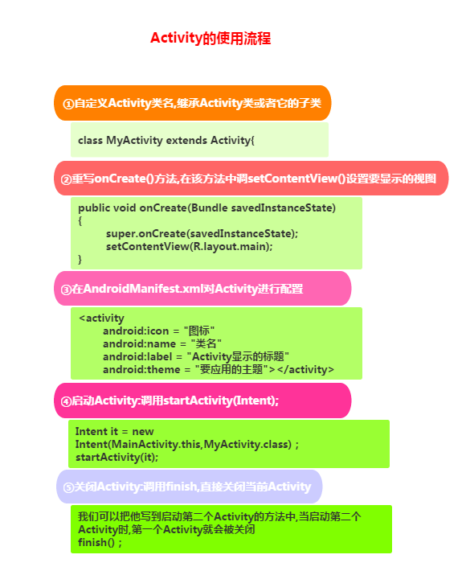    
启动一个Activity的几种方式:
  1. 显示启动:
```java {.line-numbers}
// 1. 最常见的：
startActivity(new Intent(当前Act.this,要启动的Act.class));
// 2. 通过Intent的ComponentName：
ComponentName cn = new ComponentName("当前Act的全限定类名","启动Act的全限定类名") ;
Intent intent = new Intent() ;
intent.setComponent(cn) ;
startActivity(intent) ;
// 3. 初始化Intent时指定包名：
Intent intent = new Intent("android.intent.action.MAIN");
intent.setClassName("当前Act的全限定类名","启动Act的全限定类名");
startActivity(intent);
```
  2. 隐式启动
   AndroidManifest中通过Intent-filter的Action,Category或data来实现
## P53 生命周期
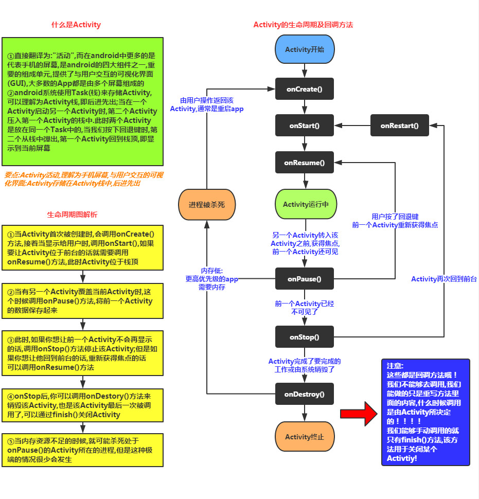     
## P54 组件间通信 Intent
### P54 组件间通信 Intent 传入1
```java {.line-numbers}
Intent in = new Intent(FirstActivity.this, ThirdActivity.class);
//1.传单个数据
in.putExtra("test","TTIT");
in.putExtra("number",100);
startActivity(in);
```
### P54 组件间通信 Intent 传入2
```java {.line-numbers}
Intent in = new Intent(FirstActivity.this, ThirdActivity.class);
//2.传多个数据
Bundle b = new Bundle();
b.putInt("number", 100);
b.putString("test", "TTIT");
in.putExtras(b);
startActivity(in);
```
### P54 组件间通信 Intent 传出
```java {.line-numbers}
// 1.FirstActivity启动ThirdActivity
startActivityForResult(in, 1001);
// 2.FirstActivity接受ThirdActivity返回的数据
@Override
protected void onActivityResult(int requestCode, int
resultCode, @Nullable Intent data) {
super.onActivityResult(requestCode, resultCode, data);
Log.e("tag", "requestCode =" + requestCode);
Log.e("tag", "resultCode =" + resultCode);
Log.e("tag", "data =" + data.getStringExtra("back"));
}
// 3.ThirdActivity设置返回的数据
Intent backIn = new Intent();
backIn.putExtra("back", "abcdef");
setResult(1002, backIn);
```
## P55 Back Stack（回退堆栈）
``` {.line-numbers}
Java栈Stack概念：
后进先出(LIFO)，常用操作入栈(push)，出栈(pop)，处于最顶部的叫栈顶，最底部叫栈底
```
``` {.line-numbers}
Activity 管理机制:
1.我们的APP一般都是由多个Activity构成的，而在Android中给我们提供了一个Task(任务)的概念， 就是将多个相关的Activity收集起来，然后进行Activity的跳转与返回;
2.当切换到新的Activity，那么该Activity会被压入栈中，成为栈顶！ 而当用户点击Back键，栈顶的Activity出栈，紧随其后的Activity来到栈顶！
3.Task是Activity的集合，是一个概念，实际使用的Back Stack来存储Activity，可以有多个Task，但是 同一时刻只有一个栈在最前面，其他的都在后台
```
``` {.line-numbers}
1.FLAG_ACTIVITY_NEW_TASK
  默认启动标志，该标志控制创建一个新的Activity实例，首先会查找是否存在和被启动的Activity具有相同的亲和性的任务栈 如果有，则直接把这个栈整体移动到前台，并保持栈中旧activity的顺序不变，然后被启动的Activity会被压入栈，如果没有，则新建一个栈来存放被启动的activity
  Intent intent = new Intent(A.this, A.class);
  intent.setFlags(Intent.FLAG_ACTIVITY_NEW_TASK);
  startActivity(intent);
2.FLAG_ACTIVITY_CLEAR_TOP
  如果已经启动了四个Activity：A，B，C和D。在D Activity里，我们要跳到BActivity，同时希望C finish掉,可以采用下面启动方式，这样启动B Activity，就会把D，C都finished掉
  Intent intent = new Intent(D.this, B.class);
  intent.setFlags(Intent.FLAG_ACTIVITY_CLEAR_TOP);
  startActivity(intent);
3.FLAG_ACTIVITY_SINGLE_TOP
  从名字中不难看出该Flag相当于Activity加载模式中的singleTop模式，即原来Activity栈中有A、B、C、D这4个Activity实例，当在Activity D中再次启动Activity D时，Activity栈中依然还是A、B、C、D这4个Activity实例。
  Intent intent = new Intent(D.this, D.class);
  intent.setFlags(Intent.FLAG_ACTIVITY_CLEAR_TOP);
  startActivity(intent);
```

## P56 启动模式
``` {.line-numbers}
模式详解：
standard模式 ：
  标准启动模式，也是activity的默认启动模式。在这种模式下启动的activity可以被多次实例化，即在同一个任务中可以存在多个activity的实例，每个实例都会处理一个Intent对象。如果Activity A的启动模式为standard，并且A已经启动，在A中再次启动Activity A，即调用startActivity（new Intent（this，A.class）），会在A的上面再次启动一个A的实例，即当前的桟中的状态为A-->A。
singleTop模式 ：
  如果一个以singleTop模式启动的Activity的实例已经存在于任务栈的栈顶，那么再启动这个Activity时，不会创建新的实例，而是重用位于栈顶的那个实例，并且会调用该实例的onNewIntent()方法将Intent对象传递到这个实例中。举例来说，如果A的启动模式为singleTop，并且A的一个实例已经存在于栈顶中，那么再调用startActivity（newIntent（this，A.class））启动A时，不会再次创建A的实例，而是重用原来的实例，并且调用原来实例的onNewIntent()方法。这时任务栈中还是这有一个A的实例。如果以singleTop模式启动的activity的一个实例 已经存在与任务栈中，但是不在栈顶，那么它的行为和standard模式相同，也会创建多个实例。
singleTask模式 ：
  只允许在系统中有一个Activity实例。如果系统中已经有了一个实例，持有这个实例的任务将移动到顶部，同时intent将被通过onNewIntent()发送。如果没有，则会创建一个新的Activity并置放在合适的任务中。
singleInstance模式 ：
  保证系统无论从哪个Task启动Activity都只会创建一个Activity实例,并将它加入新的Task栈顶也就是说被该实例启动的其他activity会自动运行于另一个Task中。当再次启动该activity的实例时，会重用已存在的任务和实例。并且会调用这个实例 的onNewIntent()方法，将Intent实例传递到该实例中。和singleTask相同，同一时刻在系统中只会存在一个这样的Activity实例。
```
### P56 启动模式 standard模式:
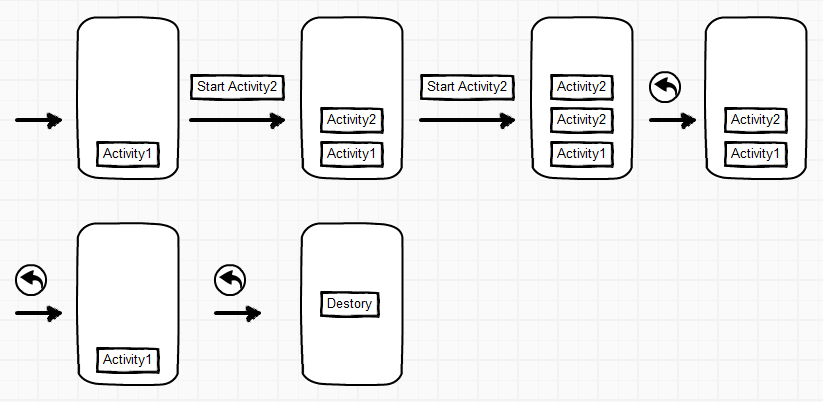

### P57 启动模式 singleTop模式:
**singleTop只要处于栈顶就不会重复创建，如果没有处于栈顶还是会重复创建**  
在该模式下，如果栈顶Activity为我们要新建的Activity（目标Activity），那么就不会重复创建新的Activity。  
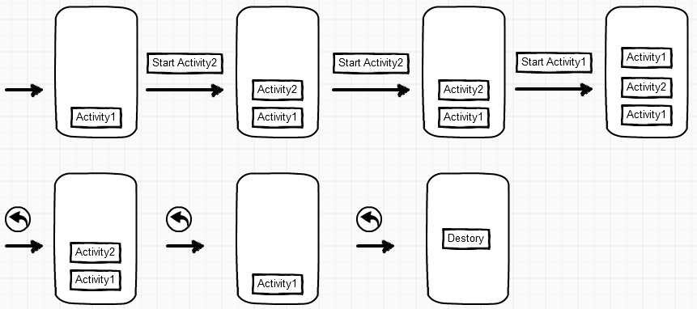

### P58 启动模式 singleTask模式:
``` {.line-numbers}
与singleTop模式相似，只不过singleTop模式是只是针对栈顶的元素，而singleTask模式下，如果task栈内存在目标Activity实例，则：
将task内的对应Activity实例之上的所有Activity弹出栈。
将对应Activity置于栈顶，获得焦点。
```
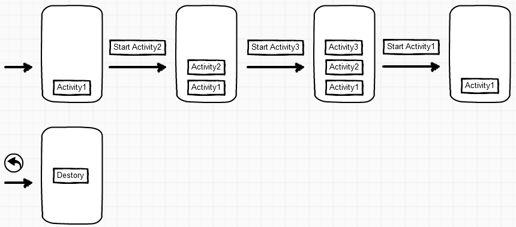

### P59 启动模式 singleInstance（全局唯一）模式:
是我们最后的一种启动模式，也是我们最恶心的一种模式：在该模式下，我们会为目标Activity分配一个新的affinity，并创建一个新的Task栈，将目标Activity放入新的Task，并让目标Activity获得焦点。新的Task有且只有这一个Activity实例。 如果已经创建过目标Activity实例，则不会创建新的Task，而是将以前创建过的Activity唤醒（对应Task设为Foreground状态）
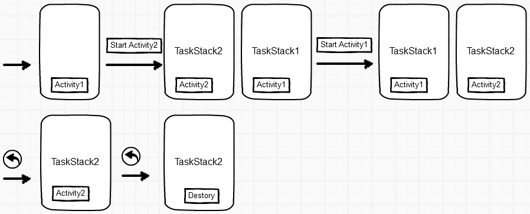

# Service(服务)
## 线程
### 线程的相关概念
* 程序：为了完成特定任务，用某种语言编写的一组指令集合(一组静态代码)  
* 进程：运行中的程序，系统调度与资源分配的一个独立单位，操作系统会为每个进程分配一段内存空间！程序的依次动态执行，经历代码的加载，执行，执行完毕的完整过程！  
* 线程：比进程更小的执行单元，每个进程可能有多条线程，线程需要放在一个进程中才能执行，线程由程序负责管理，而进程则由系统进行调度！  
* 多线程的理解：并行执行多个条指令，将CPU时间片按照调度算法分配给各个线程，实际上是分时执行的，只是这个切换的时间很短，用户感觉到"同时"而已！  
### 线程的生命周期
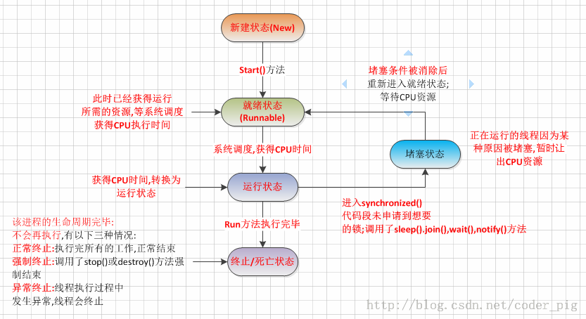  
### 创建线程的三种方式
1. 继承Thread类
```java {.line-numbers}
public class MyThread extends Thread{
   @Override
   public void run() {
      // TODO Auto-generated method stub
      //super.run();
      doSomething();
   } 
   private void doSomething() {
      // TODO Auto-generated method stub
      System.out.println("我是一个线程中的方法");
   }
}
/************************************************/
public class NewThread {
   public static void main(String[] args) {
         MyThread myThread=new MyThread();
         myThread.start();//开启一个线程方法
         //以下的方法可与上边的线程并发执行
         doSomething();
      } 
      private static void doSomething() {
      // TODO Auto-generated method stub
   }
}
```
2. 实现Runnable接口
```java {.line-numbers}
public class RunnableThread implements Runnable{
   @Override
   public void run() {
      // TODO Auto-generated method stub
      doSomeThing();
   } 
   private void doSomeThing() {
      // TODO Auto-generated method stub
      System.out.println("我是一个线程方法");
   }
}
/************************************************/
public class NewThread {
   public static void main(String[] args) {
      Runnable runnable=new RunnableThread();
      Thread thread=new Thread(runnable);
      thread.start();//开启一个线程方法
      //以下的方法可与上边的线程并发执行
      doSomething();
   } 
   private static void doSomething() {
      // TODO Auto-generated method stub
   }
}
```
3. 实现Callable接口和Future创建线程
```java {.line-numbers}
public class CallableThread implements Callable<String>{
   @Override
   public String call() throws Exception {
      // TODO Auto-generated method stub
      doSomeThing();
      return "需要返回的值";
   } 
   private void doSomeThing() {
      // TODO Auto-generated method stub
      System.out.println("我是线程中的方法");
   }
}
/************************************************/
public class NewThread {
   public static void main(String[] args) {
      Callable<String> callable=new CallableThread();
      FutureTask<String> futureTask=new FutureTask<String>(callable);
      Thread thread=new Thread(futureTask);
      thread.start();//开启一个线程方法
      //以下的方法可与上边的线程并发执行
      doSomething();
      try {
         futureTask.get();//获取线程返回值
      } catch (InterruptedException | ExecutionException e) {
         // TODO Auto-generated catch block
         e.printStackTrace();
      }
   } 
   private static void doSomething() {
      // TODO Auto-generated method stub
   }
}
```
### Service与Thread线程的区别
其实他们两者并没有太大的关系，不过有很多朋友经常把这两个混淆了！   
Thread是线程，程序执行的最小单元，分配CPU的基本单位！ 
而Service则是Android提供一个允许长时间留驻后台的一个组件，最常见的用法就是做轮询操作！或者想在后台做一些事情，比如后台下载更新！ 记得别把这两个概念混淆！
### P60_NewThread
线程的三种创建方式演示  
## Service的生命周期 P61_ServiceActivity
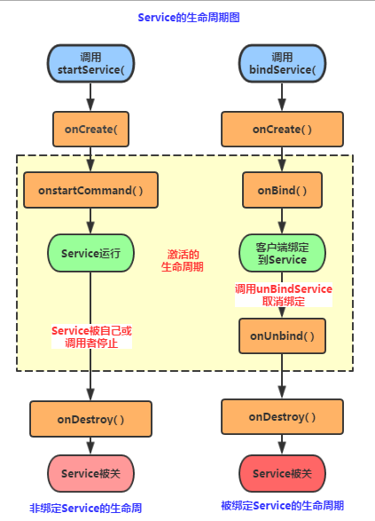  
``` {.line-numbers}
生命周期函数解析：
  1）onCreate()：当Service第一次被创建后立即回调该方法，该方法在整个生命周期 中只会调用一次！
  2）onDestory()：当Service被关闭时会回调该方法，该方法只会回调一次！
  3）onStartCommand(intent,flag,startId)：早期版本onStart(intent,startId), 当客户端调用startService(Intent)方法时会回调，可多次调用StartService方法， 但不会再创建新的Service对象，而是继续复用前面产生的Service对象，但会继续回调 onStartCommand()方法！
  IBinder onOnbind(intent)：该方法是Service都必须实现的方法，该方法会返回一个 IBinder对象，app通过该对象与Service组件进行通信！
  4）onUnbind(intent)：当该Service上绑定的所有客户端都断开时会回调该方法！
```
## service启动方式： P62_Service2Activity
``` {.line-numbers}
1）StartService()启动Service
2）BindService()启动Service
PS:还有一种，就是启动Service后，绑定Service！
```
### StartService启动Service
``` {.line-numbers}
  (1) 首次启动会创建一个Service实例,依次调用onCreate()和onStartCommand()方法,此时Service 进入运行状态,如果再次调用StartService启动Service,将不会再创建新的Service对象, 系统会直接复用前面创建的Service对象,调用它的onStartCommand()方法！
  (2) 但这样的Service与它的调用者无必然的联系,就是说当调用者结束了自己的生命周期, 但是只要不调用stopService,那么Service还是会继续运行的!
  (3) 无论启动了多少次Service,只需调用一次StopService即可停掉Service
```
### BindService启动Service
``` {.line-numbers}
  (1) 当首次使用bindService绑定一个Service时,系统会实例化一个Service实例,并调用其onCreate()和onBind()方法,然后调用者就可以通过IBinder和Service进行交互了,此后如果再次使用bindService绑定Service,系统不会创建新的Sevice实例,也不会再调用onBind()方法,只会直接把IBinder对象传递给其他后来增加的客户端!
  (2) 如果我们解除与服务的绑定,只需调用unbindService(),此时onUnbind和onDestory方法将会被调用!这是一个客户端的情况,假如是多个客户端绑定同一个Service的话,情况如下当一个客户完成和service之间的互动后，它调用unbindService() 方法来解除绑定。当所有的客户端都和service解除绑定后，系统会销毁service。（除非service也被startService()方法开启）
  (3) 另外,和上面那张情况不同,bindService模式下的Service是与调用者相互关联的,可以理解为"一条绳子上的蚂蚱",要死一起死,在bindService后,一旦调用者销毁,那么Service也立即终止!
  * 通过BindService调用Service时调用的Context的bindService的解析bindService(Intent Service,ServiceConnection conn,int flags)
  * service:通过该intent指定要启动的Service
  * conn:ServiceConnection对象,用户监听访问者与Service间的连接情况, 连接成功回调该对象中的onServiceConnected(ComponentName,IBinder)方法; 如果Service所在的宿主由于异常终止或者其他原因终止,导致Service与访问者间断开 连接时调用onServiceDisconnected(CompanentName)方法,主动通过unBindService() 方法断开并不会调用上述方法!
  * flags:指定绑定时是否自动创建Service(如果Service还未创建), 参数可以是0(不自动创建),BIND_AUTO_CREATE(自动创建)
```
### StartService启动Service后bindService绑定
``` {.line-numbers}
  * 如果Service已经由某个客户端通过StartService()启动,接下来由其他客户端 再调用bindService()绑定到该Service后调用unbindService()解除绑定最后在 调用bindService()绑定到Service的话,此时所触发的生命周期方法如下:
  * onCreate( )->onStartCommand( )->onBind( )->onUnbind( )->onRebind( )
  * PS:前提是:onUnbind()方法返回true!!! 这里或许部分读者有疑惑了,调用了unbindService后Service不是应该调用 onDistory()方法么!其实这是因为这个Service是由我们的StartService来启动的 ,所以你调用onUnbind()方法取消绑定,Service也是不会终止的!
  * 得出的结论: 假如我们使用bindService来绑定一个启动的Service,注意是已经启动的Service!!! 系统只是将Service的内部IBinder对象传递给Activity,并不会将Service的生命周期 与Activity绑定,因此调用unBindService( )方法取消绑定时,Service也不会被销毁！
```

# BroadcastReceiver 广播接收器
## 前言  
为了方便Android系统各个应用程序及程序内部进行通信，Android系统引入了一套广播机制。各个应用程序可以对感兴趣的广播进行注册，当系统或者其他程序发出这条广播的时候，对发出的广播进行注册的程序便能够收到这条广播。为此，Android系统中有一套完整的API，允许程序只有的发送和接受广播。  
## 在Android系统中，主要有两种基本的广播类型：  
### 标准广播（Normal Broadcasts）  
```java {.line-numbers}
//是一种完全异步执行的广播，在广播发出之后，所有的广播接收器会在同一时间接收到这条广播，广播无法被截断.
//发送方式：
Intent intent=new Intent("com.example.dimple.BROADCAST_TEST");
sendBroadcast(intent);
```
### 有序广播（Ordered Broadcasts）
```java {.line-numbers}
//是一种同步执行的广播，在广播发出之后，优先级高的广播接收器可以优先接收到这条广播，并可以在优先级较低的广播接收器之前截断停止发送这条广播。
//发送方式：
Intent intent=new Intent("com.example.dimple.BROADCAST_TEST");
sendOrderBroadcast(intent，null);//第二个参数是与权限相关的字符串。
```
## 注册广播
```java {.line-numbers}
//在Android的广播接收机制中，如果需要接收广播，就需要创建广播接收器。而创建广播接收器的方法就是新建一个类（可以是单独新建类，也可以是内部类（public）） 继承自BroadcastReceiver
class myBroadcastReceiver extends BroadcastReceiver{
   @Override
   public void onReceive(Context context, Intent intent) {
     //不要在广播里添加过多逻辑或者进行任何耗时操作,因为在广播中是不允许开辟线程的, 当onReceiver( )方法运行较长时间(超过10秒)还没有结束的话,那么程序会报错(ANR), 广播更多的时候扮演的是一个打开其他组件的角色,比如启动Service,Notification提示, Activity等！
   }
}
```
动态注册和静态注册的区别
```md {.line-numbers}
* 动态注册的广播接收器可以自由的控制注册和取消，有很大的灵活性。但是只能在程序启动之后才能收到广播，此外，不知道你注意到了没，广播接收器的注销是在onDestroy()方法中的。所以广播接收器的生命周期是和当前活动的生命周期一样。
* 静态注册的广播不受程序是否启动的约束，当应用程序关闭之后，还是可以接收到广播
```
## 两种方式注册广播：
### 动态注册
```java {.line-numbers}
//所谓动态注册是指在代码中注册。步骤如下 ：
//- 实例化自定义的广播接收器。
//- 创建IntentFilter实例。
//- 调用IntentFilter实例的addAction()方法添加监听的广播类型。
//- 最后调用Context的registerReceiver(BroadcastReceiver,IntentFilter)动态的注册广播。
//PS:这里提醒一点，如果需要接收系统的广播（比如电量变化，网络变化等等），别忘记在AndroidManifest配置文件中加上权限。
//另外，动态注册的广播在活动结束的时候需要取消注册：
@Override
protected void onDestroy() {
  super.onDestroy();
  unregisterReceiver(myBroadcastReceiver);
}
```
### 静态注册
```xml {.line-numbers}
<receiver
  android:name="com.ttit.core.broadcastreceiver.MyBRReceiver2">
    <intent-filter>
      <action
        android:name="com.example.broadcasttest.MY_BROADCAST" />
    </intent-filter>
</receiver>
```

# ContentProvider(内容提供者)
## ContentProvider应用场景：  
  * 我们想在自己的应用中访问别的应用，或者说一些ContentProvider暴露给我们的一些数据， 比如手机联系人，短信等！我们想对这些数据进行读取或者修改，这就需要用到ContentProvider了！  
  * 我们自己的应用，想把自己的一些数据暴露出来，给其他的应用进行读取或操作，我们也可以用到ContentProvider，另外我们可以选择要暴露的数据，就避免了我们隐私数据的的泄露！   
   
## ContentProvider概念讲解    
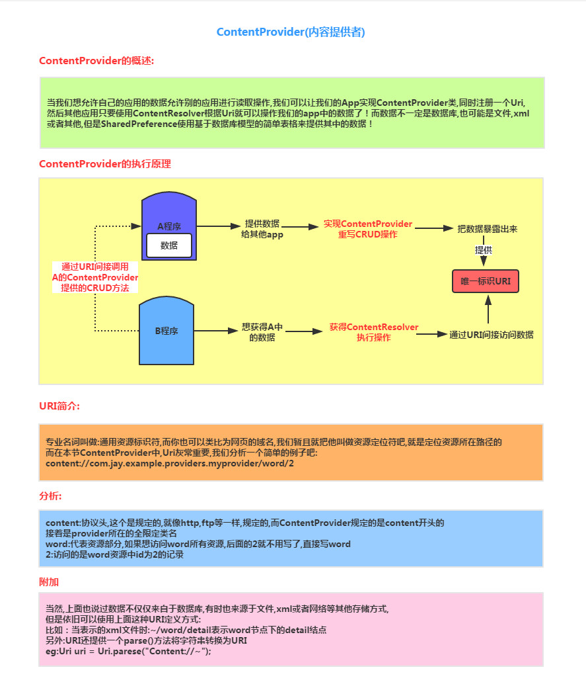  
## ContentProvider的URI
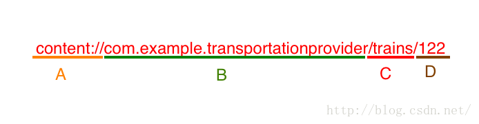  
``` {.line-numbers}
* 主要分三个部分：scheme, authority and path。scheme表示上图中的content://，authority表示B部分，path表示C和D部分。
* A部分：表示是一个Android内容URI，说明由ContentProvider控制数据，该部分是固定形式，不可更改的。
* B部分：是URI的授权部分，是唯一标识符，用来定位ContentProvider。格式一般是自定义ContentProvider类的完全限定名称，注册时需要用到，如：com.example.transportationprovider
* C部分和D部分：是每个ContentProvider内部的路径部分，C和D部分称为路径片段，C部分指向一个对象集合，一般用表的名字，如：/trains表示一个笔记集合；D部分指向特定的记录，如：/trains/122表示id为122的单条记录，如果没有指定D部分，则返回全部记录。
```
## 使用系统提供的ContentProvider 
第66课前半部分讲解  
打开模拟器的file  
exploer/data/data/com.android.providers.contacts/databases/contact2.db 导出  
下载SQLiteStudio软件  
导出后使用SQLite图形工具查看  
三个核心的表:raw_contact表，data表，mimetypes表  
## 自定义ContentProvider P66_ContentProvider2Activity
我们自己的应用，想把自己的一些数据暴露出来，给其他的应用进行读取或操作，我们也可以用到ContentProvider，另外我们可以选择要暴露的数据，就避免了我们隐私数据的的泄露！  
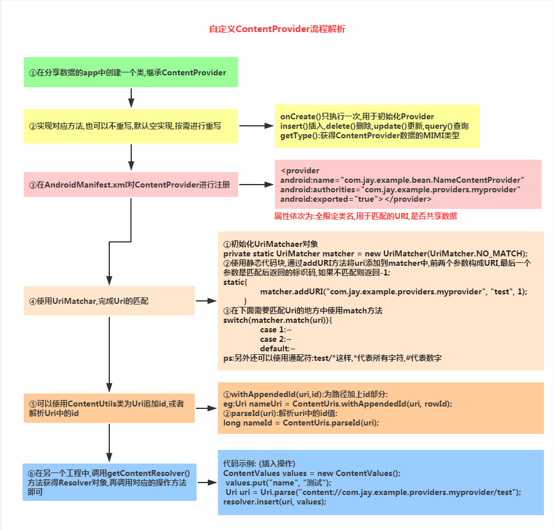   

# Fragment（碎片）
``` {.line-numbers}
我们可以把他看成一个小型的Activity，又称Activity片段！想想，如果一个很大的界面，我们 就一个布局，写起界面来会有多麻烦，而且如果组件多的话是管理起来也很麻烦！而使用Fragment我们可以把屏幕划分成几块，然后进行分组，进行一个模块化的管理！从而可以更加方便的在 运行过程中动态地更新Activity的用户界面！另外Fragment并不能单独使用，他需要嵌套在Activity中使用，尽管他拥有自己的生命周期，但是还是会受到宿主Activity的生命周期的影响，比如Activity 被destory销毁了，他也会跟着销毁  
```
## Fragment的生命周期图
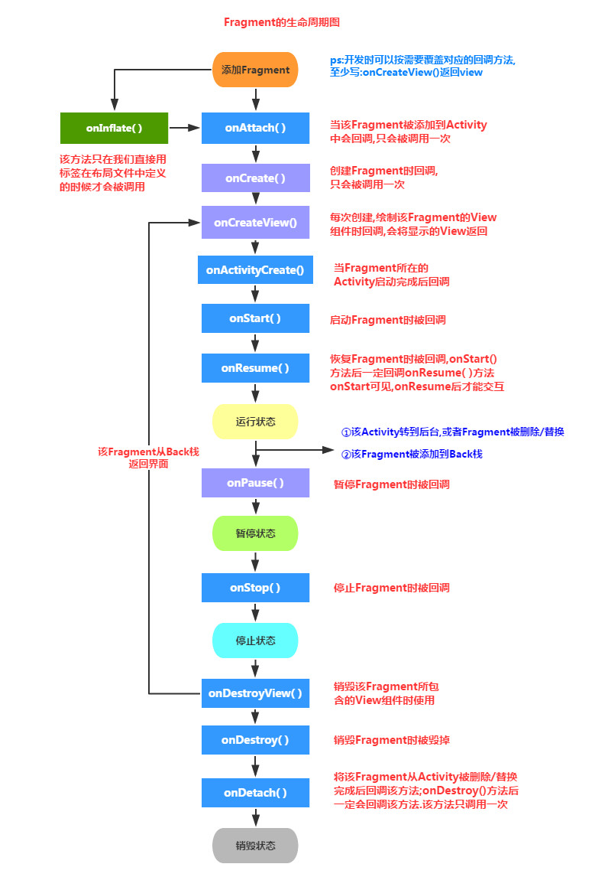  

``` {.line-numbers}
  (1)Activity加载Fragment的时候,依次调用下面的方法: onAttach -> onCreate ->onCreateView -> onActivityCreated -> onStart ->onResume  
  (2)当我们弄出一个悬浮的对话框风格的Activity,或者其他,就是让Fragment所在的Activity可见,但不获得焦点 onPause  
  (3)当对话框关闭,Activity又获得了焦点: onResume  
  (4)当我们替换Fragment,并调用addToBackStack()将他添加到Back栈中 onPause -> onStop -> onDestoryView ！！注意,此时的Fragment还没有被销毁哦!!!  
  (5)当我们按下键盘的回退键，Fragment会再次显示出来: onCreateView -> onActivityCreated-> onStart -> onResume  
  (6)如果我们替换后,在事务commit之前没有调用addToBackStack()方法将 Fragment添加到back栈中的话;又或者退出了Activity的话,那么Fragment将会被完全结束, Fragment会进入销毁状态onPause -> onStop -> onDestoryView -> onDestory -> onDetach  
```
``` {.line-numbers}
addToBackStack()方法的作用：当移除或替换一个Fragment并向返回栈添加事务时，系统会停止（而非销毁）移除的Fragment。如果用户执行回退操作进行Fragment的恢复，该Fragment将重新启动。如果不向返回栈添加事务，则系统会在移除或替换Fragment时将其销毁。  
```
## 使用V4包还是app包下面的Fragment  
``` {.line-numbers}
其实都可以，前面说过Fragment是Android 3.0(API 11)后引入的，那么如果开发的app需要 在3.0以下的版本运行呢?比如还有一点点市场份额的2.3!于是乎,v4包就这样应运而生了, 而最低可以兼容到1.6版本！至于使用哪个包看你的需求了,现在3.0下手机市场份额其实已经不多了,随街都是4.0以上的，6.0十月份都出了，你说呢...所以这个时候,你可以直接使用app包下的Fragment 然后调用相关的方法，通常都是不会有什么问题的;如果你Fragment用了app包的, FragmentManager和FragmentTransaction都需要是app包的！要么用全部用app,要么全部用v4, 不然可是会报错的哦!当然如果你要自己的app对于低版本的手机也兼容的话,那么就可以选择用v4包！
```
## 创建一个Fragment
### 静态加载Fragment
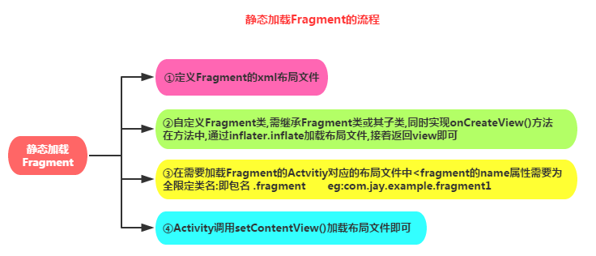  
```xml {.line-numbers}
<fragment
  android:id="@+id/myfragment"
  android:name="com.ttit.core.Fragment.MyFragment"
  android:layout_width="match_parent"
  android:layout_height="300dp" />
<!-- ps: 必须添加id属性 -->
```
**静态加载Fragment步骤**
1. 在maina activity layout中增加fragment标签
2. 在fragment标签增加属性android:name
3. 新建MyFragment extends Fragment 

### 动态加载Fragment
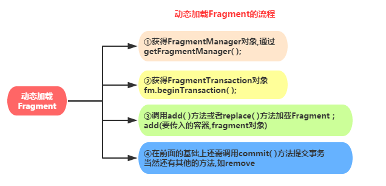  
## Fragment管理与Fragment事务
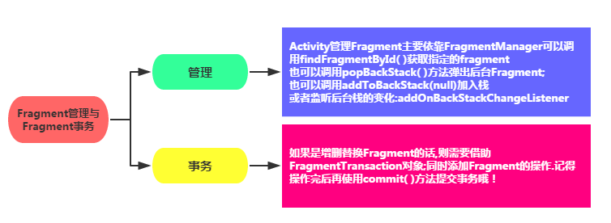  
### main activity传递数据给fragment
在main activity中   
```java {.line-numbers}
Bundle b = new Bundle();
b.putString("name", "jack");
myFragment.setArguments(b);
```
在P67_MyFragment2类中的onCreateView方法里  
```java {.line-numbers}
String name = (String) getArguments().get("name");
Log.e("ttit", "name = " + name);
```
### fragment传递数据给main activity
在P67_MyFragment2类中的提供一个接口
```java {.line-numbers}
public interface CallBack {
    void getResult(String result);
}
```
在P67_MyFragment2类中的提供一个回调方法，类似于按钮的回调方法
```java {.line-numbers}
 public void setCallBack(CallBack callBack) {
    String msg = "传递给宿主FragActivity的数据";
    callBack.getResult(msg);
}
```
在main activity中实现回调接口
```java {.line-numbers}
myFragment.setCallBack(new P67_MyFragment2.CallBack() {
    @Override
    public void getResult(String result) {
        Log.e("ttit", "result = " + result);
    }
});
```
## Fragment与Activity的交互
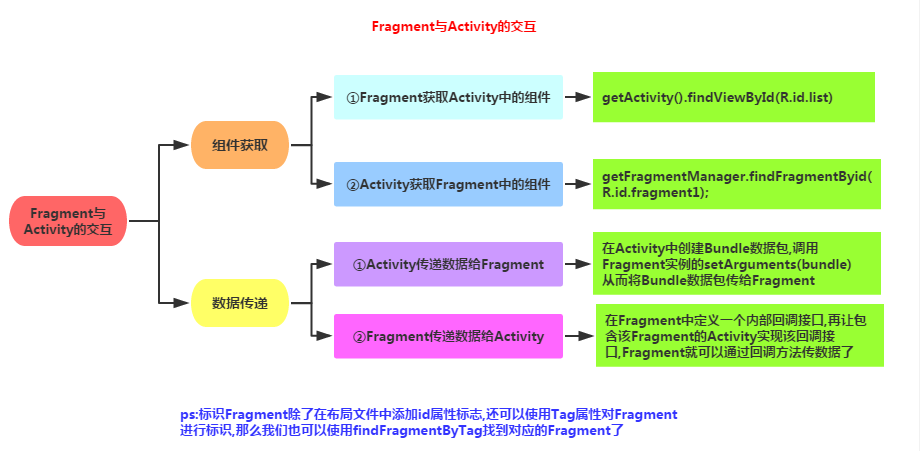  
```xml {.line-numbers}

```